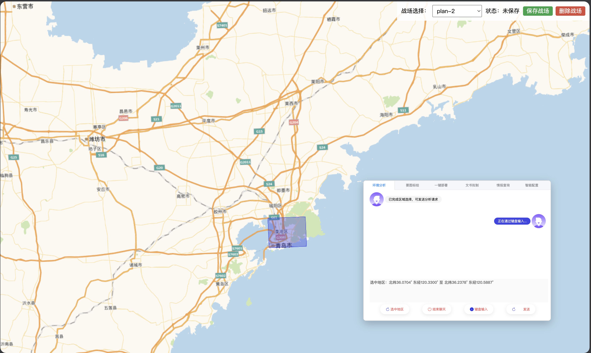
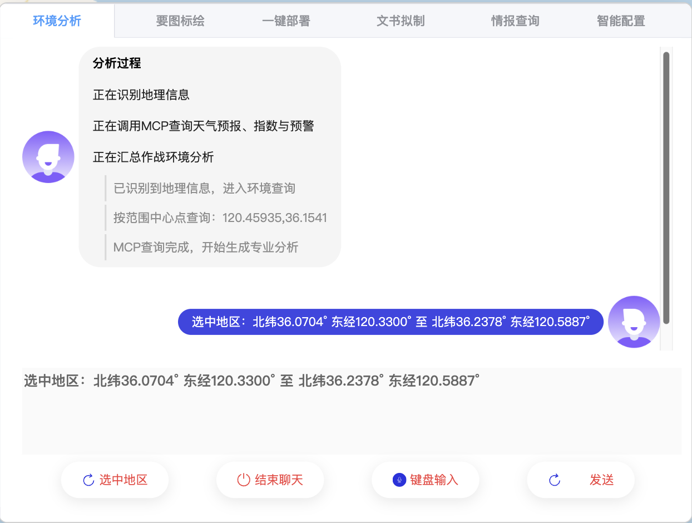
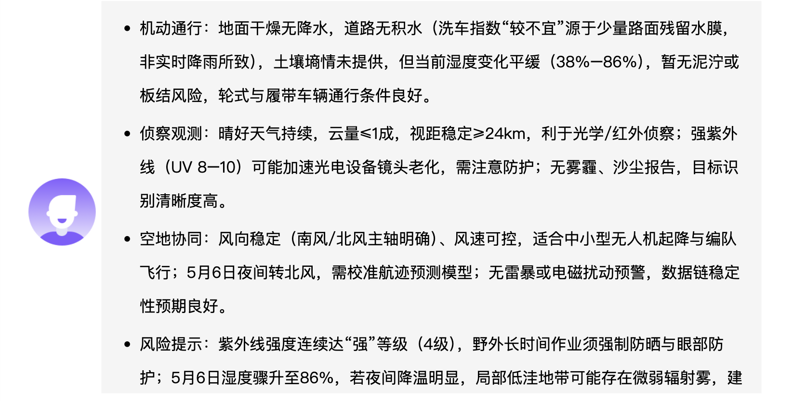
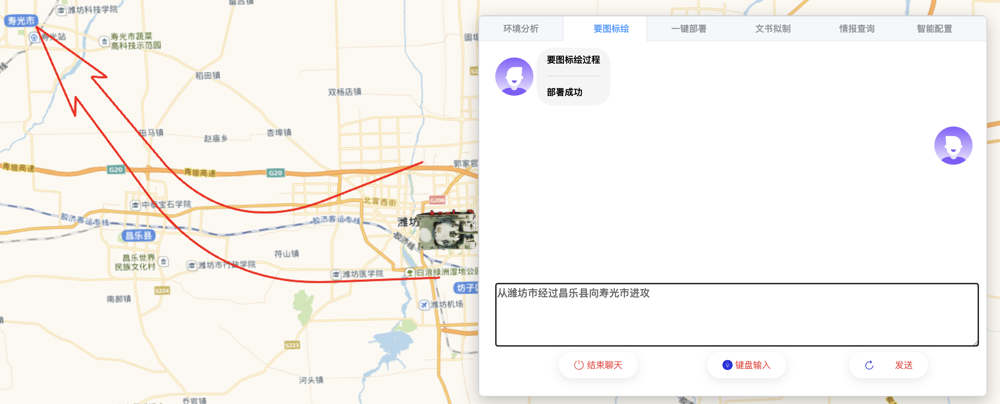
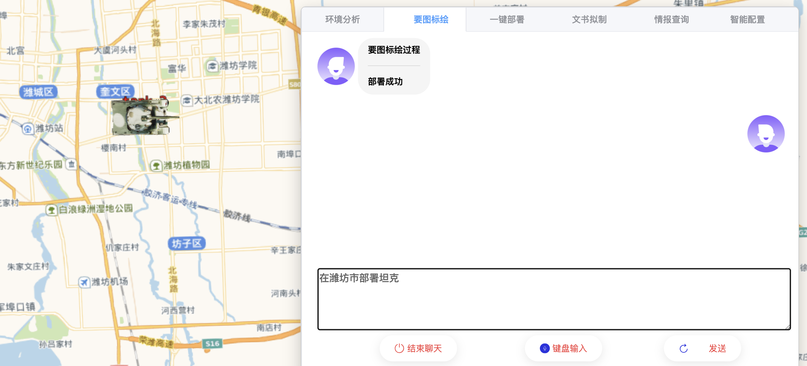
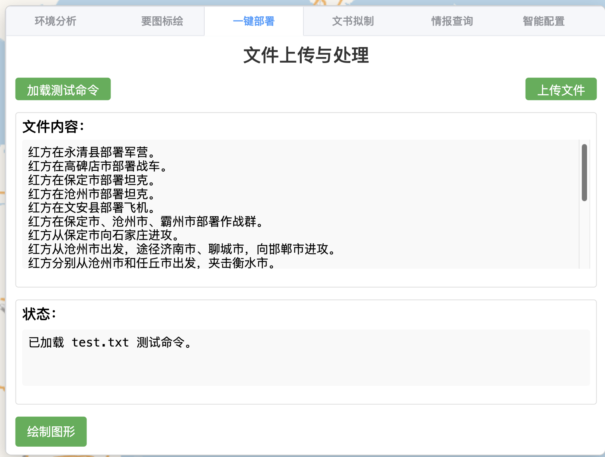
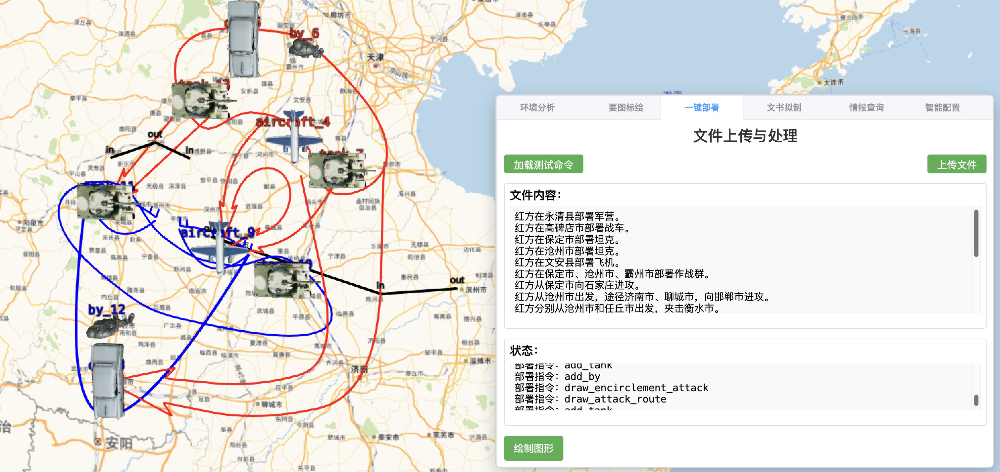
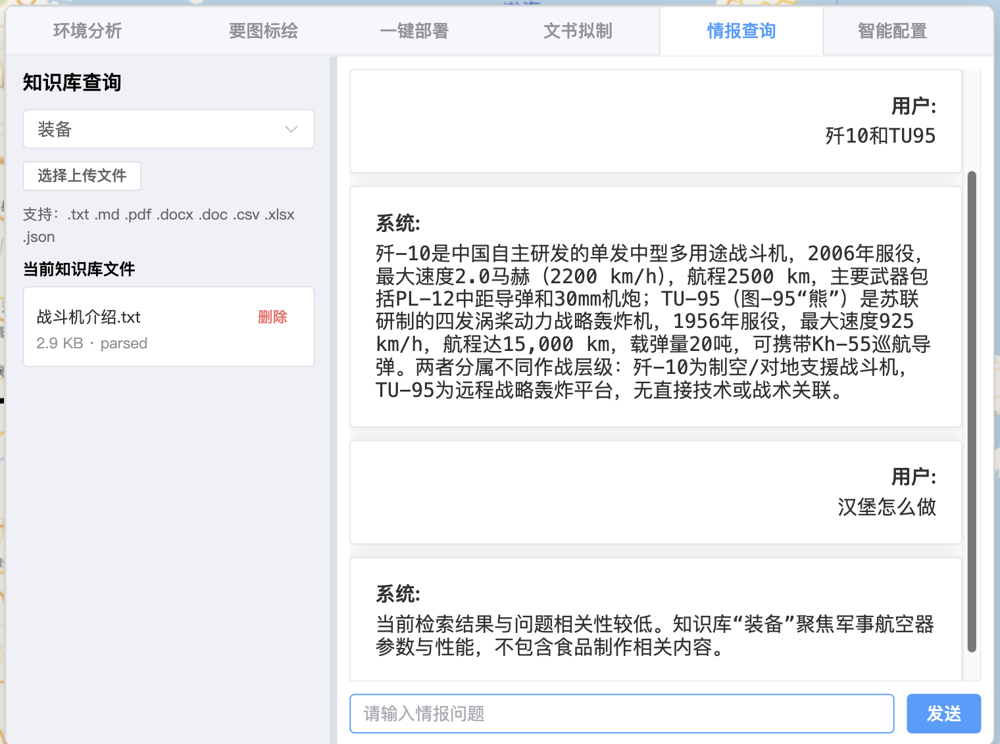
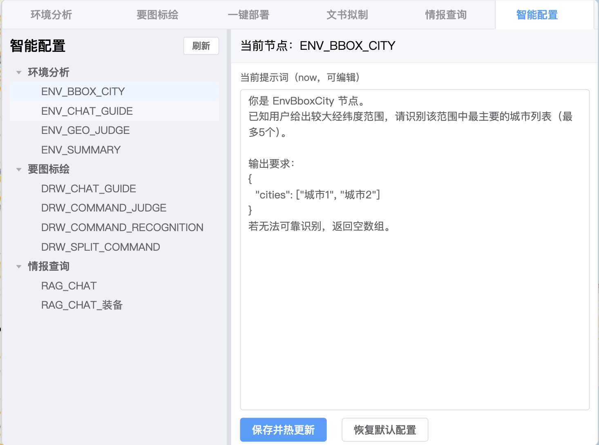

# 大模型地图标注系统

这是一个“地图态势 + 大模型指挥辅助”的前后端一体项目，支持自然语言/语音输入，完成地图部署、图形标绘、环境分析、知识检索和文书拟制等业务流程。

## 项目结构

```text
大模型标注4.6/
├── map-ai-server/   # Spring Boot 后端（LLM编排、ASR、RAG、计划管理、MCP工具）
├── map-ai-web/      # Vue3 前端（地图展示、交互、标绘、部署、知识库与配置界面）
└── README.md        # 当前文件（仓库级说明）
```

## 全部项目功能

### 1) 环境分析

- 对用户输入进行分阶段解析与结论输出。
- 前端按“过程 + 结果”结构展示，便于追踪分析链路。






### 2) 要图标绘

- 将自然语言识别为绘图指令并在地图执行。
- 支持进攻、途径点进攻、包围进攻、作战群、防御阵地、分界线等图形。
- 展示流程为“指令分类 -> 标注信息 -> 部署结果”。

插图状态：已插图



### 3) 一键部署

- 支持批量指令切分、逐条识别、统一下发执行。
- 命令执行后写入当前战场方案，便于保存与回放。

插图状态：已插图



### 4) 文书拟制

- 本模块的实际功能是：根据战场情况绘制作战文书。
- 当前版本仅提供基础展示与交互链路。
- 由于本模块提示词敏感且存在设计风险，核心能力暂未在当前模型中完整实现与展示。


### 5) 情报查询（RAG）

- 支持知识库创建、文件上传、文件删除、问答检索。
- 后端执行文本抽取与向量检索，返回基于知识库的回答。

插图状态：已插图


### 6) 智能配置

- 支持在线查看和编辑各节点提示词。
- 支持保存热更新与恢复默认配置。

插图状态：已插图



### 7) 战场方案管理（Plan）

- 以 `plan_id` 管理不同战场态势。
- 支持新建、切换、保存、删除战场。
- 支持“已保存/未保存”状态展示。


### 8) 语音输入与ASR

- 前端支持语音采集与文本输入切换。
- 后端提供实时 ASR WebSocket 服务。


## 技术栈

- 前端：Vue 3、Vite、Element Plus、Ant Design Vue、Cesium
- 后端：Spring Boot 3、Spring AI Alibaba、Redis、DashScope SDK
- 能力集成：ASR WebSocket、RAG 向量检索、MCP（天气/地理等工具）

## 文档说明

- 前端启动与配置：请查看 [map-ai-web/README.md](map-ai-web/README.md)
- 后端启动与配置：请查看 [map-ai-server/README.md](map-ai-server/README.md)

本 README 仅描述项目定位、结构与功能说明，不重复前后端的详细启动步骤。
