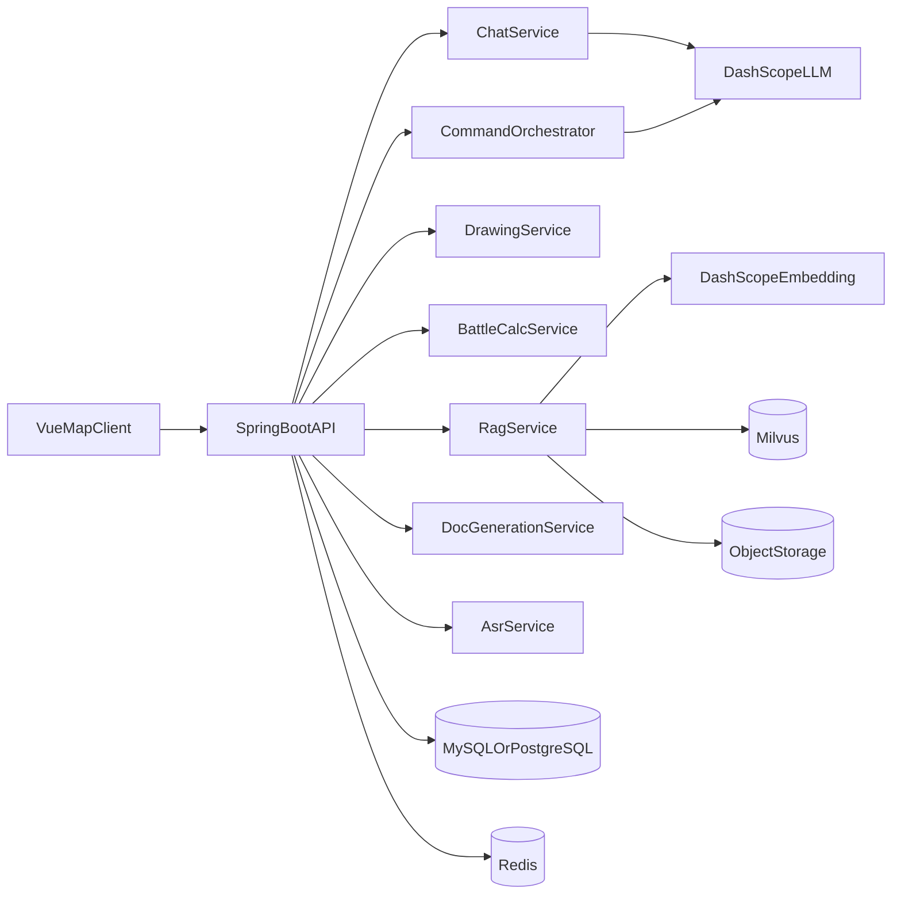

# 大模型地图标注应用项目规划（Spring AI Alibaba 后端重构版）

## 1. 项目目标与定位

### 1.1 背景
- 现有系统采用 Python 后端 + Vue 前端，功能覆盖较广，但代码质量与可维护性不足，难以继续迭代。
- 目标是保留现有前端（地图展示与交互能力），重构后端为 Spring Boot + Spring AI Alibaba 架构，形成稳定、可扩展、可上线的版本。

### 1.2 产品目标
- 打造一个“地图态势 + 大模型智能指挥辅助”的业务平台。
- 支持从自然语言/语音输入到地图动作执行、作战计算、知识检索、文书生成的一体化闭环。
- 具备可持续扩展能力（新指令类型、新绘制规则、新知识库、新模型接入）。

### 1.3 核心功能范围
- 地图展示（保留现有 Vue + 地图引擎适配层）
- 大模型对话（普通问答 + 任务类指令）
- 语音转文字（ASR）
- 模糊指令识别与结构化解析
- 地图绘制（群、阵地、机场、箭头等）
- 装备放置（如坦克、车辆等实体）
- 作战计算（时间、路线、抵达评估等）
- RAG 知识库查询（军情/条令/规则）
- 文书生成（标准格式模板输出）

---

## 2. 产品架构设计（PM 视角）

### 2.1 用户流程（MVP）
1. 用户在前端地图页面输入文本或语音。
2. 后端完成语音识别（如有）并做指令清洗。
3. 指令路由层判断是“对话问答”还是“地图动作/计算/文书任务”。
4. 对地图任务进行结构化解析，返回标准动作 JSON。
5. 前端根据动作 JSON 驱动地图引擎绘制/放置实体。
6. 如涉及知识问答，触发 RAG 检索并返回可信答案。
7. 如涉及文书，按模板生成结果并支持回填地图要素。

### 2.2 领域模块划分
- 会话与交互域：聊天、上下文、流式输出
- 指令理解域：模糊语义解析、意图识别、参数抽取
- 地图作图域：图元生成、坐标计算、实体管理
- 作战计算域：规则计算与时空推演
- 知识检索域：文档入库、向量检索、答案生成
- 文书生成域：模板管理、字段映射、文本生成
- 平台支撑域：鉴权、日志、监控、配置管理

### 2.3 非功能目标
- 可维护性：清晰分层、统一异常与日志、可测试
- 稳定性：接口幂等、超时重试、模型降级
- 可扩展性：Agent Tool 插拔式扩展
- 性能：流式返回、异步计算、向量检索缓存
- 安全：输入校验、敏感信息脱敏、操作审计

---

## 3. 总体技术架构（建议）

### 3.1 后端技术栈
- Java 17+
- Spring Boot 3.x
- Spring Web + SSE（流式）
- Spring AI Alibaba（DashScope 聊天与 Embedding）
- Milvus（向量库）
- MySQL/PostgreSQL（业务数据）
- Redis（会话与热点缓存）
- MinIO/OSS（文档文件存储）

### 3.2 前端技术栈（保持原本）
- Vue3 + 现有 `MapEngine` 适配层
- 地图渲染维持当前实现（AMap/Cesium 双适配思路）
- 通过统一 API 层对接新后端，尽量不改动核心渲染逻辑

### 3.3 系统关系图


---

## 4. 前后端文件框架规划

## 4.1 后端（新建：`map-agent-server`）目录建议
```text
map-agent-server/
├── pom.xml
├── src/main/java/com/company/mapagent/
│   ├── MapAgentApplication.java
│   ├── common/
│   │   ├── config/                 # 通用配置（Web、CORS、Jackson、SSE）
│   │   ├── exception/              # 统一异常与错误码
│   │   ├── response/               # 统一返回体
│   │   ├── util/                   # 工具类
│   │   └── constant/               # 常量
│   ├── auth/                       # 登录鉴权（可选，二期）
│   ├── chat/
│   │   ├── controller/ChatController.java
│   │   ├── service/ChatService.java
│   │   ├── service/impl/ChatServiceImpl.java
│   │   ├── dto/
│   │   └── agent/                  # ReactAgent/SupervisorAgent 构建
│   ├── command/
│   │   ├── controller/CommandController.java
│   │   ├── service/CommandParseService.java
│   │   ├── service/CommandRouteService.java
│   │   ├── tool/                   # 模糊指令识别工具
│   │   └── model/                  # 指令结构体（意图、参数）
│   ├── map/
│   │   ├── controller/MapController.java
│   │   ├── service/EntityService.java
│   │   ├── service/GraphicService.java
│   │   ├── service/DrawingService.java
│   │   ├── domain/                 # 实体/图元聚合
│   │   └── repository/
│   ├── battle/
│   │   ├── controller/BattleCalcController.java
│   │   ├── service/BattleCalcService.java
│   │   ├── service/geometry/       # 几何算法迁移（来自 Draw_node/calculate）
│   │   └── model/
│   ├── rag/
│   │   ├── controller/RagController.java
│   │   ├── service/RagService.java
│   │   ├── service/VectorIndexService.java
│   │   ├── service/VectorSearchService.java
│   │   ├── service/DocumentChunkService.java
│   │   ├── tool/InternalKnowledgeTools.java
│   │   └── model/
│   ├── voice/
│   │   ├── controller/VoiceController.java
│   │   ├── service/AsrService.java
│   │   └── adapter/                # 第三方 ASR 适配
│   ├── document/
│   │   ├── controller/DocController.java
│   │   ├── service/DocGenerationService.java
│   │   ├── template/               # 文书模板
│   │   └── model/
│   ├── integration/
│   │   ├── dashscope/              # 模型客户端配置
│   │   ├── milvus/                 # 向量库客户端
│   │   ├── mapapi/                 # 地图服务 API（如地理编码）
│   │   └── observability/          # Prometheus/日志平台
│   └── task/
│       ├── async/                  # 异步任务
│       └── scheduler/              # 定时任务（可选）
├── src/main/resources/
│   ├── application.yml
│   ├── application-dev.yml
│   ├── application-prod.yml
│   ├── db/migration/               # Flyway/Liquibase
│   └── prompts/                    # 提示词模板
└── src/test/java/...               # 单测与集成测试
```

## 4.2 前端（保留：`map-agent-admin`）目录优化建议
```text
map-agent-admin/
├── src/
│   ├── api/
│   │   ├── chat.js                 # /api/chat/api/chat_stream
│   │   ├── command.js              # /api/command/parse /execute
│   │   ├── map.js                  # /api/map/entity /graphic
│   │   ├── battle.js               # /api/battle/calculate
│   │   ├── rag.js                  # /api/rag/query /upload
│   │   ├── voice.js                # /api/voice/asr
│   │   └── document.js             # /api/document/generate
│   ├── store/
│   │   ├── modules/chat.js
│   │   ├── modules/map.js
│   │   ├── modules/command.js
│   │   └── modules/session.js
│   ├── components/
│   │   ├── MapDisplay/             # 保留现有
│   │   ├── MapEngine/              # 保留现有
│   │   ├── ChatPanel/              # 对话与任务日志
│   │   ├── VoiceInput/             # 录音上传与识别结果展示
│   │   ├── KnowledgePanel/         # RAG 查询面板
│   │   └── DocPanel/               # 文书生成面板
│   ├── views/
│   │   ├── CommandWorkbench.vue    # 主工作台（地图+对话+输出）
│   │   └── SystemSettings.vue
│   ├── utils/
│   │   ├── commandTransformer.js   # 后端动作JSON转前端执行指令
│   │   └── sseClient.js
│   └── App.vue
└── package.json
```

---

## 5. 前后端接口规划（第一版）

### 5.1 会话与指令
- `POST /api/chat`：普通对话
- `POST /api/chat/stream`：流式对话
- `POST /api/command/parse`：模糊指令识别并结构化
- `POST /api/command/execute`：执行地图动作/计算任务

### 5.2 地图对象与绘制
- `POST /api/map/entities`：放置实体（坦克等）
- `DELETE /api/map/entities/{id}`：删除实体
- `GET /api/map/entities`：查询实体
- `POST /api/map/graphics/draw`：绘图动作提交

### 5.3 计算、知识、文书、语音
- `POST /api/battle/calculate`
- `POST /api/rag/upload`
- `POST /api/rag/query`
- `POST /api/document/generate`
- `POST /api/voice/asr`

---

## 6. 重构策略（降低风险）

### 6.1 迁移原则
- 前端先不大改：优先通过 API 兼容层对接新后端。
- 后端按领域逐步替换：先“可用”，再“优化”。
- 算法与绘制能力先迁移原逻辑，再逐步重写。

### 6.2 分阶段实施
- P0（打底）
  - Spring Boot 工程初始化
  - Chat + 指令解析最小链路跑通
  - 前端接入新域名与统一网关
- P1（核心）
  - 地图绘制、实体放置、作战计算迁移
  - RAG 入库与检索跑通
- P2（增强）
  - 文书模板引擎
  - 语音识别与纠错链路
  - 监控、鉴权、审计完善

---

## 7. 风险与应对
- 指令稳定性风险：增加“意图置信度 + 二次确认”机制。
- 模型输出不确定：JSON Schema 校验 + 自动重试 + 回退策略。
- 旧前端兼容风险：建立 `commandTransformer` 层，隔离协议变更。
- 绘制算法迁移风险：先构建回归样例集，逐个图元验收。
- RAG 质量风险：分块策略、召回阈值、答案引用来源展示。

---

## 8. TODO（执行清单）

### 8.0 当前迭代（2026-04-20）
- [ ] 任务A：环境分析-地图框选改为实时流畅反馈
  - 做什么：按住鼠标左键拖拽时，地图上实时显示半透明矩形框，松开后保留最终区域。
  - 要求：不能等鼠标停下才出现；拖拽过程中连续更新；重复选择时清除旧框。
  - 如何检测：
    - 进入“环境分析”后点击“选中地区”并拖拽，矩形框跟随鼠标连续变化。
    - 松开后保留最终区域文本（经纬范围）并写入输入框。

- [ ] 任务B：环境分析-发送链路统一到 `/api/llm/submit_msg`
  - 做什么：发送按钮与回车发送时，将“选中区域文本 + 用户输入”提交到统一接口。
  - 要求：仅前端打通，不做业务解析；只检查请求是否成功。
  - 如何检测：
    - 浏览器 Network 中出现 `POST /api/llm/submit_msg`，payload 中包含 message。
    - 2xx 时界面显示“发送成功”，非2xx/异常显示“发送失败”。

- [ ] 任务C：文书拟制-语音/键盘流程对齐“要图标绘”
  - 做什么：采用与“要图标绘”一致的 ASR 采集与切换流程（语音/键盘可切换、发送可用）。
  - 要求：去掉旧润色/旧文书接口依赖，避免 `recorder.clear/getNextData` 报错。
  - 如何检测：
    - 点击开始聊天后可实时识别填入输入框。
    - 语音输入与键盘输入来回切换后，仍可继续识别和发送。

- [ ] 任务D：文书拟制-发送链路统一到 `/api/llm/submit_msg`
  - 做什么：文书拟制发送按钮与回车发送，统一提交到同一接口。
  - 要求：仅校验成功与否，不实现后端文书结构化逻辑。
  - 如何检测：
    - 浏览器 Network 中出现 `POST /api/llm/submit_msg`。
    - 成功时显示“发送成功”，失败时显示“发送失败”。

- [ ] 任务E：API 收敛
  - 做什么：新增统一前端 API 封装 `submitMsg`，减少组件直连旧 NLP 接口。
  - 要求：环境分析与文书拟制均通过同一 API 文件调用。
  - 如何检测：
    - 代码中两个组件均引入并调用 `submitMsg`。
    - 构建通过，页面可正常打开并发送请求。

### 8.1 产品与需求
- [ ] 完成 MVP 需求基线（必须功能/可延后功能）
- [ ] 定义核心用户角色与典型任务场景（至少 5 个）
- [ ] 输出指令词典与意图分类清单（地图、计算、问答、文书）

### 8.2 架构与工程
- [ ] 初始化 `map-agent-server`（Spring Boot + Spring AI Alibaba）
- [ ] 建立统一异常、统一响应、日志追踪（traceId）
- [ ] 完成 `dev/test/prod` 多环境配置与密钥管理方案

### 8.3 后端能力开发
- [ ] 完成聊天接口（普通 + SSE 流式）
- [ ] 完成指令解析与动作 JSON 协议（含 schema 校验）
- [ ] 完成地图实体与图元接口
- [ ] 迁移作战计算核心算法（并补单测）
- [ ] 打通 RAG：上传、切片、向量化、检索、回答
- [ ] 完成文书生成接口与模板系统
- [ ] 接入语音识别（上传音频 -> 文本 -> 指令纠错）

### 8.4 前端改造
- [ ] 新建 `src/api` 模块并替换旧请求入口
- [ ] 保留 `MapEngine`，新增动作转换层 `commandTransformer`
- [ ] 增加对话面板、知识库面板、文书面板、语音输入组件
- [ ] 增加任务状态与错误提示（加载/超时/重试）

### 8.5 测试与上线
- [ ] 建立接口回归测试（重点：指令解析与绘图）
- [ ] 建立端到端场景测试（语音 -> 指令 -> 地图动作）
- [ ] 完成性能压测（SSE 并发、检索耗时）
- [ ] 完成上线清单（监控告警、回滚预案、操作手册）

---

## 9. 验收标准（MVP）
- 用户可在地图界面完成“自然语言/语音 -> 地图动作执行”的闭环。
- 可稳定放置坦克与执行至少 3 类战术图形绘制。
- 可完成至少 2 类作战计算并返回可解释结果。
- 可完成 RAG 问答并展示引用来源。
- 可生成标准化文书，并支持一键复制与下载。
